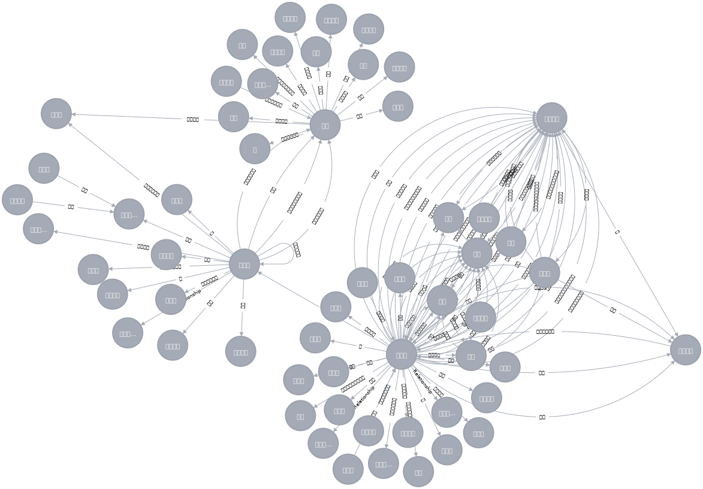

# 基于依存句法关系的知识抽取工具
&emsp;&emsp;本工具基于依存句法关系对非结构化文本进行事实三元组抽取。
## 抽取模板：
- 主语+谓语+宾语（SBV+VOB），如：“特朗普是美国总统。”。
- 主语+谓语+宾补（SBV+CMP+POB），如：“哈德森出身在伦敦。”。
- 主语+谓语+介宾（SBV+ADV+POB），如：“乔布斯在斯坦福大学演讲。”。
- 并列结构（COO），如：“奥巴马和特朗普……”。
- 人物修饰词抽取，将修饰词作为人物的身份，如：“美国前总统奥巴马……”。
## 文件说明
### 核心
- parse_util.py：分词、词性标注及依存句法关系分析等功能实现。
- extractor.py：三元组抽取等功能实现。
### 数据相关（提供了可以运行的例子，也可忽略）
- data/db_util.py：读写neo4j等功能实现。
- data/data_loader.py：fetch_data_from_file函数读取example.json。
- data/example.json：25条爬取的财经类数据。
- data/corpus_process.py：对公司名、人名源数据进行了一定清洗，去除如“一家公司”这样的无意义公司名。
- data/lexicon：经整理的[公司名](https://github.com/wainshine/Company-Names-Corpus.git)、[人名](https://github.com/wainshine/Chinese-Names-Corpus.git)字典，存在大量脏数据。
## Neo4j示例

# 参考

- [Chinese Open Relation Extraction and Knowledge Base Establishment](https://www.researchgate.net/publication/323198509_Chinese_Open_Relation_Extraction_and_Knowledge_Base_Establishment?enrichId=rgreq-73aa2af9a5fc220b2c5076e9da3664d8-XXX&enrichSource=Y292ZXJQYWdlOzMyMzE5ODUwOTtBUzo2MTY5NjI4NzQ5MzczNDVAMTUyNDEwNjgyMDYzMA%3D%3D&el=1_x_3&_esc=publicationCoverPdf)